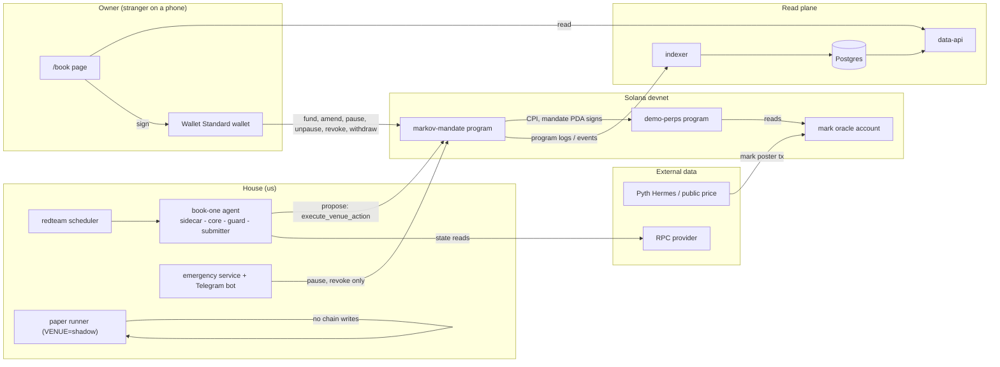
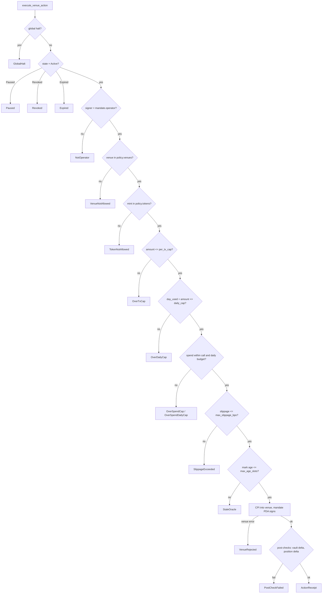
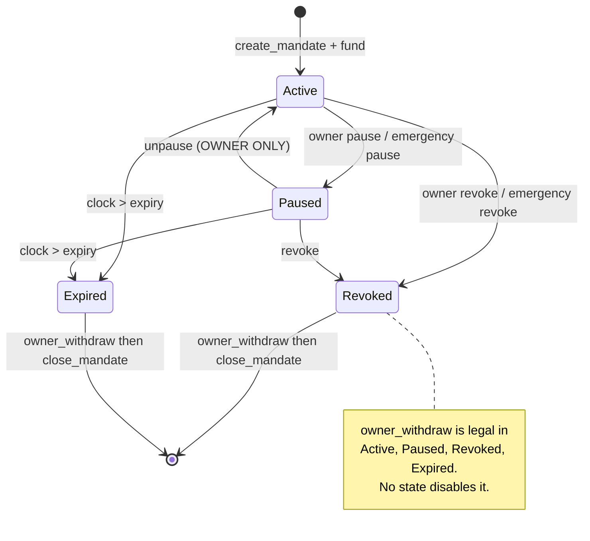
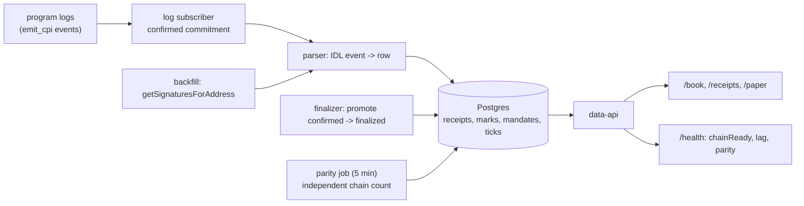
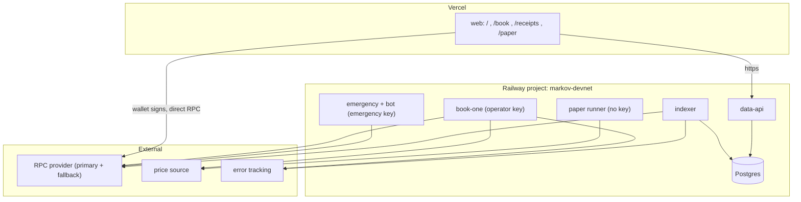

# 07 — Technical Architecture
Markov Book · 31 August 2026 · v0.1
Binding for Gate B. Supersedes nothing in `02-TECHNICAL-DECISIONS.md`; it implements it.

---

## 1. One sentence of system

An owner-controlled account on Solana devnet holds USDC-d; an off-chain house agent proposes bounded actions against a mock perp venue; the mandate program is the last gate and emits a receipt for every allow and every block; an indexer turns those logs into a public read model; one page shows it to a stranger and lets the owner leave.

## 2. Architectural rules (these override convenience)

1. **The program is the last word.** Any check done off-chain is a courtesy to the RPC bill, never a substitute. If the off-chain guard and the on-chain gate disagree, the program wins and that disagreement is a P1 bug.
2. **Fail closed everywhere.** Missing data, stale oracle, unparseable state, RPC timeout, unknown venue → refuse, do not proceed.
3. **No LLM in the signing path.** A model may only write into a `Features` struct. It cannot reach the guard, the submitter, or a keypair.
4. **Withdraw is not a feature; it is an invariant.** `owner_withdraw` must succeed in Active, Paused, Revoked, Expired, and after the operator key is compromised. Any code path that can disable it is a release blocker.
5. **Every number on a public surface is derivable from chain or a venue API.** Private files are not evidence. The API never computes a receipt it did not read from a log.
6. **Append-only reason codes.** A `BlockReason` discriminant, once emitted on devnet, is never renumbered or reused. Add, never edit.
7. **One venue, one strategy, one page.** Everything else is BACKLOG.

## 3. Context — who talks to whom



**Trust boundaries.** Three, and they are the whole product:

| Boundary | Crossed by | Enforced by |
|---|---|---|
| Owner ↔ house | operator proposals | mandate program gates + policy on-chain |
| House ↔ chain | operator key | key can propose only; cannot withdraw, unpause, or widen a cap |
| Model ↔ execution | `Features` struct | guard is a pure function over thresholds; model output is data, never control |

## 4. Process model

| Process | Language | Host | Restart policy | Holds a key? |
|---|---|---|---|---|
| `book-one` agent | Rust | Railway service | always, backoff | operator key (propose only) |
| `paper` runner | Rust, same binary `VENUE=shadow` | Railway cron/service | always | none |
| `emergency` + Telegram bot | Rust | separate Railway service | always | emergency key (pause/revoke only) |
| `indexer` | Rust | Railway service | always | none |
| `data-api` | Rust (axum) | Railway service | always | none |
| `web` | TS (TanStack Start) | Vercel | n/a | none — owner signs in their wallet |

**Decision:** the agent, indexer, API and bot are one Rust cargo workspace. Reason: the risk guard, the `BlockReason` enum, and the policy view are shared types with the program, so a mismatch between what the guard thinks and what the program enforces becomes a compile error instead of a production surprise. Cost accepted: Solana client tooling in TypeScript is more ergonomic, so the web app carries its own generated client from the IDL.

## 5. The tick — allow path and refusal path

```mermaid
sequenceDiagram
  autonumber
  participant T as scheduler (60s)
  participant S as sidecar
  participant C as book-core
  participant G as risk-guard (pure)
  participant X as submitter
  participant P as markov-mandate
  participant V as demo-perps
  participant I as indexer

  T->>S: tick(id, slot)
  S-->>C: Features{regime, funding, mark, age}
  Note over S,C: sidecar stub returns chop for Gate B
  C->>C: BookState + Features -> Intent
  Note over C: default Intent is Skip
  C->>G: evaluate(Intent, GuardState, PolicyView)
  alt guard vetoes
    G-->>X: Veto(reason)
    X-->>X: log veto, no tx (unless redteam tick)
    Note over X: refusal is recorded off-chain as a proposal;<br/>only scheduled redteam ticks force it on chain
  else guard allows
    G-->>X: Allow(Intent)
    X->>P: execute_venue_action(intent, args)
    P->>P: gate order 1..12
    alt a gate fails
      P-->>I: RefusalReceipt{reason, strategy_id}
    else all gates pass
      P->>V: CPI open/increase/reduce/close
      V-->>P: fill or venue error
      P->>P: post-checks
      P-->>I: ActionReceipt{fill, strategy_id}
    end
  end
  I->>I: parse log -> row -> API -> /book within 10s
```

**Why the redteam scheduler exists.** If the off-chain guard is good, the program never refuses anything, and B5/B7 stay red forever. So refusals are produced deliberately: a scheduled job builds intents that are *known* to violate a specific gate, bypasses the off-chain veto for that intent only (flagged `forced=true`), and submits them so the **program** does the refusing. That is the only sanctioned bypass in the system, it is off by default in `paper`, and it can never bypass a program gate — it can only guarantee one is exercised.

## 6. Gate order (the fail-closed ladder)

Evaluated in this order inside `execute_venue_action`. First failure short-circuits, emits a `RefusalReceipt`, and returns `Ok(())` so the receipt is durable rather than rolled back with the transaction.



**Receipt durability rule.** A refusal must not be an `Err` that unwinds the transaction, or there is no log to index. Gates return early and emit; only unrecoverable states (bad account layout, wrong program ID, missing signer) return a hard `Err`. This is the single most important implementation detail in the program and it gets its own test in `P02`.

## 7. Mandate state machine



`amend_policy` is legal in Active and Paused and is **tighten-only**: every numeric cap may decrease, every allowlist may shrink, expiry may shorten. A widening amendment is `PolicyNotTightened`, not a silent no-op.

## 8. Data plane



`chainReady` is **not** a boolean someone sets. It is computed:

```
chainReady = (rpc_slot_confirmed - last_indexed_slot) <= LAG_SLOTS   // default 150 (~60s)
          && (now - last_successful_ingest) < 30s
          && parity_ok                                              // last parity run matched
```

If any term is false, `/health` returns `chainReady: false` with the failing term named. The page shows a degraded chip instead of stale counters. An honest "indexer behind by 412 slots" is a better surface than a confident wrong number.

## 9. Deployment topology



**Isolation requirements (Gate B checks this):** the agent service and the emergency service are separate deployments with separate environment scopes. The emergency key never appears in the agent's environment. The web app has no key at all. Postgres is reachable only from the Railway private network; `data-api` is the only public reader.

## 10. Failure modes and the designed response

| Failure | Detection | Response | Surface |
|---|---|---|---|
| RPC primary down | send/confirm error rate | fail over to secondary, then skip ticks | `/health` degraded |
| Price source down | mark age exceeds threshold | guard vetoes every intent (`StaleOracle`); agent keeps ticking | circuit chip = `stale` |
| Indexer stalled | lag term in `chainReady` | page shows degraded chip, counters frozen with a timestamp | banner |
| Operator key compromised | out-of-policy attempt appears as refusal | nothing to steal; rotate key; owners unaffected | receipt feed |
| Emergency key compromised | unexpected pause/revoke | worst case is a stopped book; owners still withdraw | receipt feed |
| Agent overtrades | actions/hour above threshold | alert; kill switch; interval is 60s and default action is `Skip` | metrics |
| Program bug in a gate | invariant test / parity mismatch | global halt flag, then patch | halted chip |
| Postgres lost | ingest errors | rebuild from chain — the DB is a cache, never a source | rebuild runbook |

## 11. What is deliberately absent

No message queue. No Kafka. No microservice mesh. No Redis. No separate auth service — there are no accounts, the wallet is the identity. No websocket push to the browser for Gate B; a 5-second poll on a single page beats a socket you have to operate. Adding any of these before Gate B is scope leak and gets the `out-of-scope` label.

## 12. Latency and load budget

One strategy, tens of mandates, a 60-second tick. This is a small system and should be built like one.

| Path | Budget | Note |
|---|---|---|
| tick → submitted tx | < 5s | one RPC read round, one build, one send |
| confirmation → indexed row | < 5s | `confirmed` commitment subscription |
| indexed row → visible on `/book` | < 5s | 5s poll, so worst case ≈ 10s total → satisfies B9 |
| `/v1/receipts` p95 | < 200ms | single indexed table, cursor pagination |
| agent memory | < 256MB | it is a loop, not a platform |

## 13. Devnet-to-Phase-1 seams (build these now, use them later)

Three interfaces exist purely so the real-venue spike in Gate C is a new implementation and not a rewrite:

1. `VenueAdapter` trait — `demo_perps` and any future venue implement identically (§ `10-PROGRAM-SPEC` and `11-AGENT-SPEC`).
2. `MarkSource` trait — the paper runner, the devnet mark poster, and a future venue oracle all satisfy it.
3. `ReceiptSink` — the indexer reads events by IDL, not by string matching, so a program upgrade that adds a field does not break ingestion.

Nothing else is generalised. Generality that has no second implementation is decoration.
