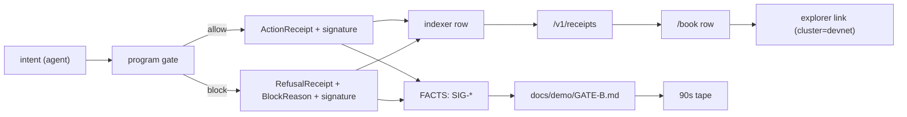

# 16 — Gate B Traceability
Markov Book · 31 August 2026 · v0.2

Every freeze-list item mapped to the component that satisfies it, the test that proves it, the artifact a stranger can open, and the FACTS key that records it. One red = Gate B open.

---

| ID | Check | Component | Test | Artifact | FACTS key | Seat |
|---|---|---|---|---|---|---|
| **B1** | `/book` hosted HTTPS, devnet label, no APY / marketplace / named venue | `apps/web` | `truth::copy_grep_clean`, Playwright `book-labels` | logged-out URL | `BOOK_URL` | Surfaces |
| **B2** | Fund; tokens in mandate PDA not operator | `markov-mandate::fund`, web fund flow | `program::fund_lands_in_vault_pda` | tx signature + explorer account view | `SIG-FUND` | Surfaces / Protocol |
| **B3** | Agent hosted, ≥60s tick, default skip, three distinct keys | `book-one`, Railway | `agent::tick_floor_60s`, `agent::skip_is_default` | service uptime + pubkeys | `OPERATOR_PUBKEY`, `EMERGENCY_PUBKEY`, `OWNER_DEMO_PUBKEY` | Agents |
| **B4** | ≥1 ActionReceipt `BOOK_ONE` in the last hour | `book-one` + program | `integration::happy_path_action` | signature + `/v1/receipts` row | `SIG-ACT` | Agents |
| **B5** | ≥1 RefusalReceipt `OverTxCap` | `redteam` + gate 8 | `program::gate_over_tx_cap` | signature | `SIG-CAP` | Agents |
| **B6** | Revoke then `Revoked` refusal | bot (emergency key) or web revoke, gate 2 | `program::gate_revoked`, e2e `revoke-then-refused` | signature **pair** | `SIG-REV`, `SIG-REV2` | Surfaces |
| **B7** | One more refusal from slippage / spend | `redteam` + gates 10–11 | `program::gate_slippage`, `program::gate_spend` | signature | `SIG-SLIP-OR-SPEND` | Agents |
| **B8** | `owner_withdraw` succeeds while Revoked, balance up | `markov-mandate::owner_withdraw` | `program::withdraw_succeeds_in_every_state` | signature + before/after balance | `SIG-WD` | Protocol / Surfaces |
| **B9** | Feed ≤10s, API count = chain count, real `chainReady` | indexer, data-api, parity job | `truth::api_parity_matches_chain` | `/health` + `/v1/receipts/stats` | `HEALTH_URL`, `RECEIPTS_API_URL` | Protocol |
| **B10** | Withdraw button enabled in Active, Paused, Revoked | `apps/web` | Playwright `withdraw-enabled-in-every-state` | screenshot + test name | — | Surfaces |
| **B11** | `demo_perps` implements the trait: mark, open, close, increase, reduce, positions | `programs/demo-perps`, `crates/markov-venue` | `venue::trait_conformance` (same suite runs against any adapter) | trait + impl in repo | `DEMO_PERPS_ID` | Protocol |
| **B12** | ≥7 consecutive dated paper files, ugly days kept | `book-one` `VENUE=shadow` | `paper::one_file_per_day`, `paper::no_backfill` | `paper/` folder | `PAPER_START_DATE` | Agents |
| **B13** | `SECURITY.md` names single-key upgrade authority; emergency cannot unpause | doc + program | `program::emergency_cannot_unpause_or_withdraw` | `docs/SECURITY.md` | `UPGRADE_AUTHORITY` | Truth |
| **B14** | 90s tape on production hosts, eight proofs committed | all | manual, replayed from a second wallet | video + `docs/demo/GATE-B.md` | all eight SIG keys | Surfaces / Truth |
| **B15** | Zero unverified live-yield / named-venue / "all eleven" sentences | `scripts/copy-grep.sh` | `truth::copy_grep_clean` | CI job output + incognito pass | — | Truth |

## Proof chain



A proof is only a proof if a stranger can walk that chain backwards from the page to the explorer without asking us anything.

## Close ritual (from the freeze list, made executable)

```bash
scripts/gate-b-verify.sh --host https://<domain> --api https://api.<domain>
# 1 open every URL logged-out (script uses a clean profile, no cookies)
# 2 replay the tape from a second wallet
# 3 chain-query receipt count vs API count for the same window
# 4 write docs/demo/GATE-B.md with the eight proofs
# 5 mark Gate B CLOSED + date in FACTS
```

Until step 5 lands in FACTS, the answer to "is Gate B closed?" is **no**, in every conversation, grant form, and thread.

## Slip rule

If 27 Sep arrives with any item red: Colosseum starts with Gate B open and is disclosed as such. Do not add a real-venue promise in the same week — that is the failure mode the roadmap already names. Close what is red first, in the order B4 → B5 → B8 → B9 → B14, because that ordering is the tape.
